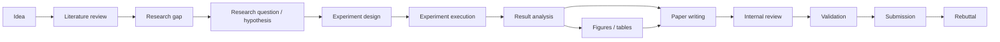

# Research Skills

A modular collection of reusable AI skills and structured templates for computer science, machine learning, data science, computer vision, uncertainty quantification, and related research workflows.

## Purpose

Research-skills helps researchers and AI agents move from an idea to a defensible manuscript and response. Skills separate literature analysis, research design, execution-result interpretation, writing, and validation. They prefer structured intermediate artifacts and traceable evidence over plausible-sounding prose.

The collection is designed to be public-safe and project-agnostic. It does not contain assumptions about a particular researcher, institution, lab, advisor, project, dataset, or computing environment.

## Principles

- Make claims traceable to evidence; mark uncertainty and missing information.
- Never fabricate citations, source support, experimental results, statistical significance, or venue requirements.
- Use structured matrices, plans, and reports before drafting claims.
- Keep analysis, validation, and writing responsibilities distinct.
- Verify changing venue rules against current official sources.
- Keep private research context outside this repository.

## Research Workflow



This is a suggested flow, not a mandatory sequence. Skills can be used independently. The intended artifact flow is:

- Verified sources → [literature matrix](templates/literature-matrix.md) → related-work outline.
- Research question → [experiment plan](templates/experiment-plan.md) → verified structured results.
- Results and source locations → [claim-evidence matrix](templates/claim-evidence-matrix.md) → bounded abstract and conclusion.
- Manuscript and supporting artifacts → reviews, reproducibility/consistency audits, and [submission checklist](templates/submission-checklist.md).

Writing skills should consume validated research artifacts rather than invent missing evidence.

## Repository Layout

```text
skills/       Focused SKILL.md instructions for each research task
shared/       Cross-skill policies, checklists, and review rubric
venues/       Lightweight venue scope notes with current-source warnings
templates/    Blank reusable research artifacts
examples/     Public-safe boundaries for future examples
```

### Skills

| Workflow area | Skill |
|---|---|
| Literature and gap analysis | [literature-review](skills/literature-review/SKILL.md), [research-gap-finder](skills/research-gap-finder/SKILL.md) |
| Research design | [research-question-designer](skills/research-question-designer/SKILL.md), [experiment-designer](skills/experiment-designer/SKILL.md) |
| Analysis and visuals | [result-analyzer](skills/result-analyzer/SKILL.md), [publication-figure](skills/publication-figure/SKILL.md), [method-diagram](skills/method-diagram/SKILL.md) |
| Writing and evidence checks | [latex-paper-writer](skills/latex-paper-writer/SKILL.md), [claim-evidence-checker](skills/claim-evidence-checker/SKILL.md), [citation-verifier](skills/citation-verifier/SKILL.md) |
| Review and readiness | [paper-reviewer](skills/paper-reviewer/SKILL.md), [reproducibility-auditor](skills/reproducibility-auditor/SKILL.md), [paper-consistency-checker](skills/paper-consistency-checker/SKILL.md), [submission-readiness](skills/submission-readiness/SKILL.md), [rebuttal](skills/rebuttal/SKILL.md) |

## Shared Resources

- Policies: [research principles](shared/research-principles.md), [academic writing](shared/academic-writing-guidelines.md), [citation policy](shared/citation-policy.md), and [evidence policy](shared/evidence-policy.md).
- Checklists and rubric: [experiments](shared/experiment-checklist.md), [reproducibility](shared/reproducibility-checklist.md), and [paper review](shared/review-rubric.md).
- [Venue profiles](venues/README.md) are orientation only. Always verify current official requirements.
- [Templates](templates/) are intentionally blank and reusable.

## Skill Validation

- Current release assessment: **usable v0.1 — six behavioral cases passed; coverage remains limited**. See the [validation results](docs/validation/research-skills-results.md) for case scores and coverage limits.
- [Synthetic behavioral cases](docs/validation/research-skills-cases.md) define representative evidence-integrity scenarios.
- [Validation results](docs/validation/research-skills-results.md) record actual runs and limitations. `NOT RUN` means no behavioral result is claimed; these cases do not establish exhaustive reliability.
- [Skill portability assessment](docs/skill-portability.md) lists repository resources each skill needs when copied.
- Run the six cases with fresh Codex CLI contexts and a separate rubric-scoring context using `python3 -B scripts/validate_skills.py run --output docs/validation/runs/run-001` (choose a new directory for each run). The harness uses only the Python standard library and requires `codex` on `PATH`; case prompts omit the scoring criteria, and captured responses and scores are stored in the output directory.

## Use a Skill

1. Choose a skill whose trigger matches the task.
2. Provide the inputs it requests and identify what is unknown or unavailable.
3. Save structured outputs with source locations and verification status.
4. Pass validated artifacts to downstream skills; do not treat a planned analysis as completed evidence.
5. Keep project-specific or sensitive inputs in an authorized private workspace, outside this public collection.

This repository's relative links assume its directory layout. To use its skills in place, point the agent's skill discovery at this repository's `skills/` directory and keep the sibling `shared/` and `templates/` directories available. If you copy the repository, preserve `skills/<name>/`, `shared/`, and `templates/` at the same relative paths; copying only a skill folder breaks its resource links. Exact discovery settings differ across tools. The core safeguards are stated in each skill, while the linked policies and templates provide additional guidance.

## Public-Safe Design

**Never commit these to this repository:**

- Personal or institutional information, contact details, credentials, secrets, private paths, or user-specific preferences.
- Unpublished project details, private experiment results, confidential reviewer material, or identifying rebuttal content.
- Proprietary or private datasets, access tokens, or data that cannot be redistributed.

Private project context belongs outside this repository. Future examples should use synthetic data, toy problems, or fully public benchmark tasks with provenance and applicable terms recorded. See [`examples/README.md`](examples/README.md) and [`AGENTS.md`](AGENTS.md).

## Contributing

Contributions should improve reusable research workflows without narrowing them to one project or environment. Before proposing a new skill, check whether the responsibility belongs in an existing skill or shared policy. Keep each skill focused, operational, and consistent with the common `SKILL.md` structure. Update this README when adding or removing a major skill, shared resource, or workflow area. See [contributor guidance](AGENTS.md).

## Limitations

These skills support research work but do not replace domain expertise, source inspection, statistical judgment, ethics review, author responsibility, or official submission instructions. They cannot guarantee exhaustive literature coverage, reproducibility, novelty, venue compliance, or acceptance. Outputs must be checked against the underlying sources and data.

## License

This repository is distributed under the [MIT License](LICENSE).
